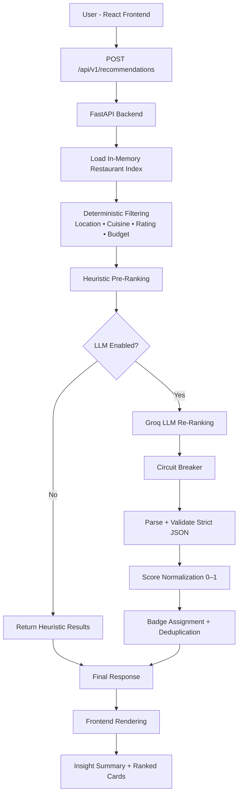

# AI Restaurant Recommendation Service

An AI-powered restaurant recommendation engine combining deterministic filtering with LLM-based comparative reasoning to deliver structured, explainable, production-grade results.

## Live Application

Frontend  
https://zomato-ai-restaurant-recommendation.vercel.app/

Swagger Docs  
https://zomato-ai-restaurant-recommendation-udnu.onrender.com/docs

---

## Product Overview

This system balances:

- Deterministic filtering for correctness  
- Heuristic pre-ranking for efficiency  
- LLM re-ranking for contextual intelligence  
- Strict JSON validation for stability  

Designed for intelligence with guardrails.

---

## Key Capabilities

- Location-based filtering  
- Dynamic cuisine dropdown by location  
- Rating threshold enforcement  
- Budget alignment  
- Comparative AI ranking  
- Score normalization between 0 and 1  
- Tradeoff-aware explanations  
- Circuit breaker protection  
- Structured JSON responses  

---

## Architecture Flow

---

## Deployment

- Frontend: Vercel  
- Backend: Render  
- LLM Provider: Groq  

---

## Built As Part Of

NextLeap Applied GenAI Bootcamp
